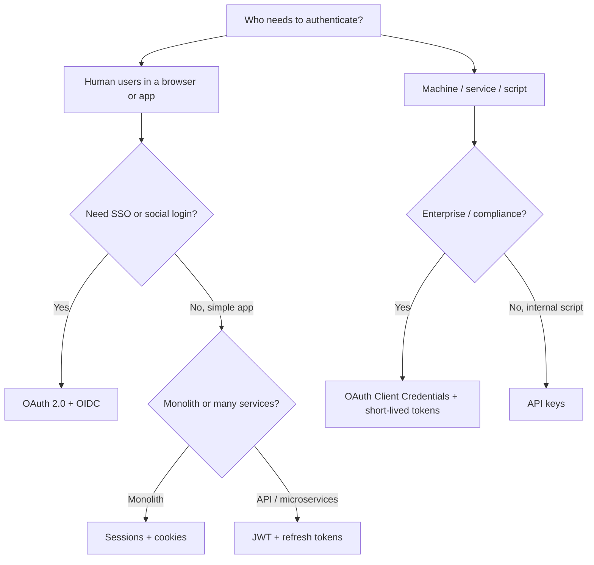
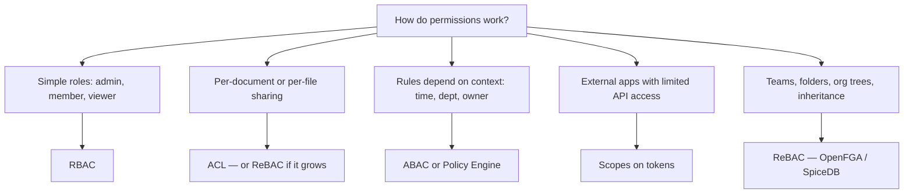

# Decision Guide

Use this page to pick authentication and authorization approaches for your project. Answer the questions in order — you can stop when you reach a recommendation.

---

## Part 1 — Authentication (who logs in?)

### Question 1: Who is logging in?



### Authentication recommendations

| Your situation | Recommended approach | Read |
|----------------|---------------------|------|
| Simple web app, one server | Sessions | [Sessions](authentication/sessions.md) |
| SPA or mobile + API backend | JWT (short-lived) + refresh | [JWT](authentication/jwt-and-bearer-tokens.md) |
| "Sign in with Google" or company SSO | OAuth + OIDC | [OAuth & OIDC](authentication/oauth-and-oidc.md) |
| CLI script, webhook, early API | API keys | [API keys](authentication/api-keys.md) |
| Service calls service (no user) | OAuth Client Credentials | [OAuth & OIDC](authentication/oauth-and-oidc.md) |

---

## Part 2 — Authorization (who can do what?)

### Question 2: How complex are your permissions?



### Authorization recommendations

| Your situation | Recommended approach | Read |
|----------------|---------------------|------|
| Admin panel, fixed roles | RBAC | [RBAC](authorization/rbac.md) |
| "Only the owner can delete" + role checks | RBAC + ownership rule (light ABAC) | [ABAC](authorization/abac.md) |
| Each resource has its own user list | ACL | [ACL](authorization/acl.md) |
| Public API, third-party integrations | Scopes | [Scopes](authorization/scopes.md) |
| Share doc with user outside team | ReBAC | [ReBAC](authorization/rebac.md) |
| Rules change often, many services | Policy engine | [Policy engines](authorization/policy-engines.md) |
| SaaS with roles + sharing + rules | Combined layers | [Combining approaches](authorization/combining-approaches.md) |

---

## Part 3 — Match your product type

| Product | Authentication | Authorization | Notes |
|---------|-------|-------|-------|
| Internal admin tool | Sessions | RBAC | Keep it simple |
| B2B SaaS dashboard | OIDC / sessions | RBAC + org tenancy | Add ABAC for "owner only" |
| Developer API | API keys → OAuth | Scopes + RBAC | Scope check per endpoint |
| Notion / Drive / Figma | OIDC | ReBAC | Relationships, not global roles |
| E-commerce | Sessions / OIDC | RBAC + ABAC | "Own orders only" is ABAC |
| Kubernetes / platform | mTLS / service accounts | OPA | Policy-as-code at scale |

---

## Part 4 — When one approach is not enough

Most real products **layer** approaches:

```text
Layer 1: RBAC        → "Is this user an editor in this org?"
Layer 2: ABAC        → "Editors can edit, but only their own drafts"
Layer 3: ReBAC       → "Unless the doc was shared with them"
Layer 4: Scopes      → "API token can only call read endpoints"
```

See [Combining approaches](authorization/combining-approaches.md) for patterns.

---

## Part 5 — Comparison at a glance

### Authorization models

| Model | Complexity | Best for | Weak when |
|-------|------------|----------|-----------|
| RBAC | Low | Fixed roles, admin panels | Cross-team sharing |
| ACL | Low–medium | Small resource lists | Many resources, global roles |
| Scopes | Medium | APIs, OAuth clients | In-app UI permissions |
| ABAC | Medium–high | Context rules, compliance | Simple apps (overkill) |
| ReBAC | High | Sharing, hierarchies | Simple CRUD |
| Policy engine | High | Many services, audit | Tiny apps |

### Authentication mechanisms

| Mechanism | Revocation | Scale | DX |
|-----------|------------|-------|-----|
| Sessions | Easy (delete session) | Needs shared store | Great for web |
| JWT | Hard (short TTL + rotation) | Excellent | Great for APIs |
| API keys | Easy (delete key) | Good | Excellent |
| OAuth/OIDC | Provider-managed | Excellent | More setup |

---

## Part 6 — Red flags (don't do this)

| Red flag | Why it's bad | Do this instead |
|----------|--------------|-----------------|
| One `isAdmin` flag for everything | No granular control | RBAC with permissions |
| Permissions only checked in frontend | Trivial to bypass | Enforce on server always |
| JWT in `localStorage` | XSS steals token | httpOnly cookie or memory |
| 401 for "not allowed" | Wrong semantics | 403 for Authorization failures |
| Global "editor" role for doc sharing | Can't share one doc | ACL or ReBAC |
| Hardcoded permissions in 50 routes | Unmaintainable | Central matrix or policy engine |

---

## Part 7 — Suggested reading order

### New to the topic

1. [Authentication vs Authorization](00-authentication-vs-authorization.md)
2. [RBAC](authorization/rbac.md)
3. [Sessions](authentication/sessions.md) or [JWT](authentication/jwt-and-bearer-tokens.md)

### Building an API

1. [API keys](authentication/api-keys.md) or [OAuth](authentication/oauth-and-oidc.md)
2. [Scopes](authorization/scopes.md)
3. [Production checklist](authorization/production-checklist.md)

### Building collaborative software

1. [ReBAC](authorization/rebac.md)
2. [Combining approaches](authorization/combining-approaches.md)
3. [Policy engines](authorization/policy-engines.md) (if rules get complex)

---

## Still stuck?

Ask yourself:

1. **Authentication or authorization?** Login problem → authentication. Permission problem → authorization.
2. **Roles enough?** Yes → RBAC. No → keep going.
3. **Sharing between users?** Yes → ReBAC or ACL.
4. **Rules depend on context?** Yes → ABAC.
5. **External API consumers?** Yes → scopes.

When in doubt, **start with RBAC** and add complexity only when you hit a wall.
